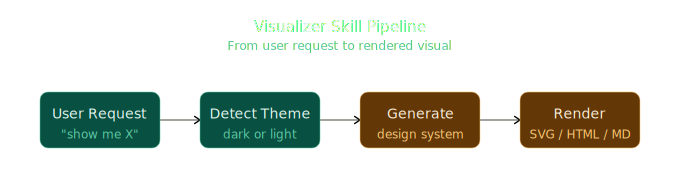

# Visualizer Skill

A framework-agnostic AI agent skill that produces high-quality **SVG / HTML visuals** — architecture diagrams, flowcharts, structural diagrams, illustrative explainers, interactive widgets, and data charts — following a strict flat-design system.

Output is raw SVG or HTML code, rendered through whatever mechanism the host agent provides: inline panels, chat bubbles, IDE preview panes, or exported `.svg` / `.html` files. The design knowledge applies anywhere SVG or HTML can render.

---

## ✨ Why This Skill Exists

LLM agents default to **walls of text**. For many concepts — system architectures, data flows, state machines, comparisons — a diagram is dramatically clearer than prose. But raw LLM-generated SVG is usually inconsistent: mismatched themes, unreadable text on dark backgrounds, broken aspect ratios, and ad-hoc styling that changes every output.

Visualizer solves this by encoding a **deterministic design system** the agent must follow:

- A fixed 9-ramp × 7-level color palette with explicit theme mapping.
- Hard technical constraints on `viewBox`, stroke widths, font sizes, and safe areas.
- Streaming-friendly output ordering (defs → visuals → script).
- Predefined diagram-type routing so the agent picks the right visual for the intent.

The result: every visual looks like it came from the same designer, every time.

---

## 🖼️ Example Output

The diagram below is **generated by this skill itself** — a horizontal flowchart rendered as raw SVG following the dark-theme flat-design system. It shows the four-stage pipeline the skill runs through for every request.



*Dark theme · teal + amber ramps · 0.5px strokes · viewBox `0 0 680 180`*

More complete worked examples live in [`assets/`](assets/):
- [`example-flowchart.svg`](assets/example-flowchart.svg) — a three-node vertical flowchart (Deploy pipeline)
- [`example-structural.svg`](assets/example-structural.svg) — a nested-container structural diagram (Service architecture)

---

## 🎯 When to Trigger

### Explicit triggers
Trigger when the user says **"show me"**, **"visualize"**, **"diagram"**, **"draw"**, **"chart"**, **"illustrate"**, **"graph"**, or **"what does X look like"** — anything where the intent is to *see* rather than *read*.

### Proactive triggers (no explicit ask needed)
- **Educational / teaching requests** — "explain X", "teach me X". Diagrams beat walls of text.
- **Data shape** — "compare X vs Y" / "show me the data" where a chart is clearer than prose.
- **Architecture & systems** — "help me design / architect X" where a diagram anchors the conversation.
- **Specification triggers** — the user hands over a noun-phrase spec naming a visual artifact ("comparison table of REST vs GraphQL", "state machine for order processing", "contact form with name/email/message"). The spec IS the request; render it.

### When NOT to use
- One-sentence dictionary-style lookups ("what is a stack").
- The user explicitly says "explain in text" or "no diagram".
- A screenshot, existing chart, or reference image is already available to cite.
- Pure math formulas or code snippets — LaTeX or code blocks render better than SVG.

---

## 🧠 Core Workflow

1. **Detect theme** — dark or light, from host context, explicit user statement, or default to **dark**.
2. **Choose output format + host adapter** — pick the rendering mechanism based on host capability (see table below).
3. **Generate the visual** — apply all critical rules and the appropriate diagram-type guidance.
4. **Multi-visualization responses** — for complex topics, break into a series of smaller visuals with prose paragraphs between them (never stack visuals back-to-back).

### Host Adapter Matrix

| Host / capability                | Render mechanism                                                       | Theme source          | Fallback if unavailable            |
|----------------------------------|------------------------------------------------------------------------|-----------------------|------------------------------------|
| WorkBuddy (inline SVG panel)     | `read_me(modules)` + `show_widget(...)`                                | `<user_info>` `IDE Theme` | Inline SVG, or write `.svg` file |
| WorkBuddy (inline HTML panel)    | `show_widget` with HTML fragment                                       | `<user_info>` `IDE Theme` | Same as above                      |
| Web chat (custom)                | Inject SVG into chat bubble DOM                                        | App theme state       | Write `.svg` file                  |
| IDE plugin                       | SVG preview pane                                                       | IDE theme API         | Write `.svg` file                  |
| Markdown-only host (GitHub, etc.)| `mermaid.js` code block                                                 | Assume dark           | Write `.svg` file                  |
| Static export / report            | Write `.svg` or `.html` file                                             | Hardcode per request  | —                                  |

---

## 📐 Design System (Critical Rules)

### Theme & readability (MANDATORY)
- Match the host theme. **Default to dark** if unknown.
- **Dark theme** → 800 fill + 200 stroke + 100/200 title text.
- **Light theme** → 50 fill + 600 stroke + 800/600 title text.
- NEVER use default SVG black text fill on a dark background — it will be invisible.

### Flat design (MANDATORY)
- No gradients, drop shadows, blur, glow, or neon effects.
- No emoji — use CSS shapes or SVG paths instead.
- Solid flat fills only. Two font weights only: 400 regular, 500 bold. Never 600/700.
- Typography: h1 = 15px, h2 = 14px, h3 = 13px (weight 500). Body = 13px weight 400, line-height 1.6.
- No font-size below 11px.

### SVG technical constraints
- `viewBox` fixed to `"0 0 680 H"` — **680 must not change**. `width="100%"` on root `<svg>`.
- `H = bottommost element y + 20px`. Calculate, do not guess.
- Safe area: x = 40 → 640, y = 40 → (H − 40). Background transparent.
- One SVG per output unit.
- 0.5px strokes for diagram borders and edges.
- Every `<path>` / `<polyline>` used as a connector MUST have `fill="none"`.
- No rotated text. No `<!-- comments -->`. No `position: fixed` in HTML.

### Streaming-friendly
- Output streams token-by-token in most hosts. Structure code so useful content appears early.
- HTML order: `<style>` (short, <15 lines) → content HTML → `<script>` last.
- SVG order: `<defs>` (markers) → visual elements immediately.
- Prefer inline `style="..."` over `<style>` blocks — inputs/controls must look correct mid-stream.

### Complexity budget (hard limits)
- Box subtitles: ≤ 5 words.
- Colors: ≤ 2 ramps per diagram (excluding c-gray neutrals).
- Horizontal tier: ≤ 4 boxes at full width (~140px each).

---

## 🗂️ Diagram Type Routing

| User intent                       | Type           | What to draw                                                       |
|-----------------------------------|----------------|--------------------------------------------------------------------|
| "how do LLMs work"                | Illustrative   | Token row, stacked layer slabs, attention threads                 |
| "transformer architecture"        | Structural     | Labelled boxes: embedding, attention heads, FFN, layer norm       |
| "what are the training steps"     | Flowchart      | Forward → loss → backward → update                                 |
| "TCP handshake sequence"          | Flowchart      | SYN → SYN-ACK → ACK                                                |
| "how does TCP work"               | Illustrative   | Two endpoints, numbered packets in flight, an ACK returning        |
| "explain the Krebs cycle / event loop" | HTML stepper  | Click through stages. Never a ring.                              |
| "draw the database schema"        | mermaid.js     | `erDiagram` syntax. Not SVG.                                      |

### Diagram-type guidance (summary)
- **Flowchart** — sequential processes, decisions. 60px min between boxes, 24px padding inside, max 4–5 nodes. Cycles become HTML steppers, not rings.
- **Structural** — containment matters. Outermost: large rounded rect (rx 20–24). Inner regions: rx 8–12. Max 2–3 nesting levels. DB schemas → mermaid `erDiagram`, never SVG.
- **Illustrative** — building intuition. Physical subjects: simplified cross-sections. Abstract subjects: spatial metaphors. Color encodes intensity, not category. One `<linearGradient>` and `<2s` CSS keyframes permitted for continuous physical properties.

---

## 🎨 Color Palette

A fixed 9-ramp × 7-level palette. Each ramp provides 7 stops from lightest (50) to darkest (900), with semantic level mapping per theme:

| Class      | 50       | 100      | 200      | 400      | 600      | 800      | 900      |
|------------|----------|----------|----------|----------|----------|----------|----------|
| c-purple   | #EEEDFE  | #CECBF6  | #AFA9EC  | #7F77DD  | #534AB7  | #3C3489  | #26215C  |
| c-teal     | #E1F5EE  | #9FE1CB  | #5DCAA5  | #1D9E75  | #0F6E56  | #085041  | #04342C  |
| c-coral    | #FAECE7  | #F5C4B3  | #F0997B  | #D85A30  | #993C1D  | #712B13  | #4A1B0C  |
| c-pink     | #FBEAF0  | #F4C0D1  | #ED93B1  | #D4537E  | #993556  | #72243E  | #4B1528  |
| c-gray     | #F1EFE8  | #D3D1C7  | #B4B2A9  | #888780  | #5F5E5A  | #444441  | #2C2C2A  |
| c-blue     | #E6F1FB  | #B5D4F4  | #85B7EB  | #378ADD  | #185FA5  | #0C447C  | #042C53  |
| c-green    | #EAF3DE  | #C0DD97  | #97C459  | #639922  | #3B6D11  | #27500A  | #173404  |
| c-amber    | #FAEEDA  | #FAC775  | #EF9F27  | #BA7517  | #854F0B  | #633806  | #412402  |
| c-red      | #FCEBEB  | #F7C1C1  | #F09595  | #E24B4A  | #A32D2D  | #791F1F  | #501313  |

| Theme | Fill | Stroke | Title text | Subtitle text |
|-------|------|--------|------------|---------------|
| Dark  | 800  | 200    | 100        | 200           |
| Light | 50   | 600    | 800        | 600           |

---

## 📦 Repository Structure

```
visualizer/
├── SKILL.md                          # Skill definition, the agent-facing spec
├── README.md                         # This document
├── assets/
│   ├── example-pipeline.svg          # Dark-theme horizontal flowchart (skill pipeline)
│   ├── example-flowchart.svg         # Complete dark-theme flowchart reference
│   └── example-structural.svg        # Complete dark-theme nested structural diagram reference
└── references/
    ├── color-palette.md              # Full 9×7 hex table, theme mapping, worked examples
    └── mermaid-syntax.md             # Mermaid code-block syntax, theme directives, supported types
```

### Bundled resources

| Resource                          | Purpose                                                        | When to load                                              |
|-----------------------------------|----------------------------------------------------------------|-----------------------------------------------------------|
| `references/color-palette.md`    | Full 9×7 hex table, theme mapping, worked examples            | When generating SVG and needing exact color values         |
| `references/mermaid-syntax.md`     | Mermaid code-block syntax, theme directives, supported types  | When falling back to mermaid for markdown-only hosts       |
| `assets/example-flowchart.svg`    | Complete dark-theme flowchart reference                       | When unsure how a finished flowchart should look           |
| `assets/example-structural.svg`    | Complete dark-theme nested structural diagram reference       | When unsure how a finished structural diagram should look |

---

## 🚀 Installation & Usage

This is a **skill** consumed by an AI coding agent (e.g., a Trae / Claude-Code-style agent). Install it through your agent's skill-loading mechanism by pointing at this directory (or cloning the repo into your agent's skill folder). The agent reads `SKILL.md` as the entry spec and loads the bundled `references/` and `assets/` on demand.

### Quick start
1. Clone the repository into your agent's skills directory:
   ```bash
   git clone git@github.com:NickyLam/Visualizer-Skill.git
   ```
2. Register the skill path with your agent (refer to your agent's skill documentation).
3. In any conversation, just ask naturally:
   - "Draw me a flowchart of the user signup flow."
   - "Visualize how a transformer's attention works."
   - "Show me a comparison table of REST vs GraphQL."
   - "I need a state machine for order processing."

The agent will detect the visual intent, pick the correct diagram type, apply the theme, and render raw SVG / HTML (or fall back to mermaid.js for markdown-only hosts).

### File export mode
When you want a downloadable file, or the host cannot render inline:
1. The skill generates the SVG per all rules above.
2. Wraps it in a minimal HTML file (`<!DOCTYPE>`, `<html>`, `<head>`, `<body>`) for `.html`, or saves raw `.svg`.
3. Suggested filename: `<descriptive-title>.svg` (kebab-case, ASCII only).

---

## ♿ Accessibility

- **HTML widgets** begin with a visually-hidden `<h2 class="sr-only">` containing a one-sentence summary.
- **SVG widgets** use `role="img"` with `<title>` and `<desc>` as first children.

---

## 🌐 CDN Allowlist (CSP-enforced)

External resources may ONLY load from:
- `cdnjs.cloudflare.com`
- `esm.sh`
- `cdn.jsdelivr.net`
- `unpkg.com`

---

## ⚠️ Common Pitfalls

- **Wrong viewBox**: must be `"0 0 680 H"`. Changing 680 breaks all coordinate calculations.
- **Dark text on dark background**: in dark theme, always use 800 fill + light (100/200) text. Default SVG text fill is black — invisible on dark.
- **Stacking visuals without prose**: always write a connecting paragraph between multiple visuals.
- **Using emoji**: forbidden. Use SVG paths or CSS shapes instead.
- **Forgetting `fill="none"` on connector paths**: they'll render as filled shapes.
- **Title not unique**: title doubles as download filename and disambiguator; make it specific.
- **Defaulting to SVG in a markdown-only host**: check the host adapter table first — use mermaid fallback for terminal agents.
- **Hardcoding theme**: always detect theme first; never assume light.
- **Over-triggering**: if a one-sentence text answer suffices, do not force a diagram.

---

## 📄 License

See the repository for license details.
